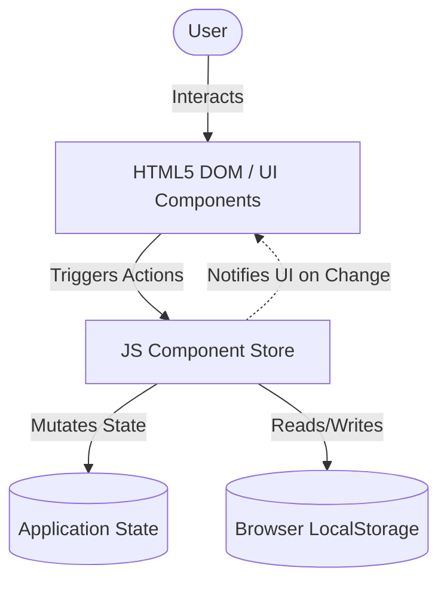

# Architecture Spine — SaaSify Subscription Tracker

## Design Paradigm

SaaSify is designed as a pure client-side **Single Page Application (SPA)** utilizing a unified **Component-Store Pattern** for state management. This pattern centralizes all state mutation operations, making components reactive to state changes and preventing synchronization errors between the dashboard metrics cards and the subscriptions table.



---

## Invariants & Rules

### AD-1 — Pure Client-Side Architecture
* **Binds:** All presentation and data mutation components.
* **Prevents:** Server-side state overhead and latency.
* **Rule:** The entire application must run client-side in the browser. It must not make calls to a backend server for application data or state processing. All layout generation, spend calculations, and alerts are computed in the user's browser. [ASSUMPTION: The host server only serves static assets (HTML/CSS/JS) with no API execution capability.]

### AD-2 — Centralized Component Store & Validation
* **Binds:** State mutation and data flow across components.
* **Prevents:** State drift where dashboard metrics cards display values inconsistent with the subscriptions table.
* **Rule:** All state mutations (Create, Update, Delete, Role Toggle) must execute through the central `Store` class API. Components must subscribe to the Store for state updates and must not mutate the state array directly. The Store must enforce strict validation rules on mutations:
  - **Name:** String, must not be blank.
  - **Cost:** Number, must be a non-negative decimal (>= 0).
  - **Billing Cycle:** String, must be strictly `MONTHLY` or `ANNUAL`.
  - **Status:** String, must be strictly `ACTIVE` or `PAUSED`.
  - **Next Renewal Date:** Date string in `YYYY-MM-DD` format.

### AD-3 — LocalStorage Data Persistence & Cross-Tab Sync
* **Binds:** Subscription and active role persistence.
* **Prevents:** Data loss on page refreshes or tab closures, and infinite sync loops across open tabs.
* **Rule:** The Store must synchronize its state to browser `localStorage` using `saasify_subscriptions` (for subscriptions) and `saasify_active_role` (for role tracking). 
  - To prevent multi-tab write loops, when a `storage` event triggers, the Store must check if the parsed string value differs from its current in-memory serialization before reloading.
  - Seeding of mock data must occur only when the `saasify_subscriptions` key is completely absent.

### AD-4 — Client-Side Role Simulation Bounds
* **Binds:** Role-based rendering and mutation safety.
* **Prevents:** Viewer users from viewing or triggering Admin-only actions, while explicitly documenting security limits.
* **Rule:** The UI must toggle controls dynamically. When the active role is Viewer, creation and edit controls must be hidden. Any mutation execution attempt under a Viewer role must trigger a console warning and fail to execute.
* **Security boundary caveat:** This client-side role toggle is a *simulated* test boundary and does not prevent code injection or console-based manipulation of state. True authorization boundaries are deferred to v2.

---

## Consistency Conventions

| Concern | Convention |
| --- | --- |
| **Naming** | Use `camelCase` for variable and function names, `PascalCase` for classes (e.g. `SubscriptionStore`), and `UPPER_SNAKE_CASE` for status and billing cycle enums. |
| **Local Timezone Date Parsing** | To prevent 1-day timezone parsing drift, dates must be parsed into local timezone boundaries. Do not parse `YYYY-MM-DD` strings directly with `new Date("YYYY-MM-DD")` (which defaults to UTC midnight). Instead, parse manually using `const [y, m, d] = str.split('-')` and construct using local boundaries: `new Date(y, m - 1, d)`. |
| **Calculations Formulas** | **Projected Monthly Spend:** sum of subscription monthly equivalents for active items. Monthly equivalent = `cost` (if cycle is `MONTHLY`) or `cost / 12` (if cycle is `ANNUAL`). Paused items add 0.<br>**Active Subscriptions:** count of items with status `ACTIVE`. |
| **Alert Range Logic** | Displays "Renewal Imminent" badge only if: `status` is `ACTIVE` and next renewal date is between 0 and 7 days in the future relative to the client's current local date. Past dates (overdue) or dates > 7 days in the future must not display the badge. |
| **Dynamic Seeding Dates** | Mock data initialization must dynamically offset next renewal dates relative to the client system date (e.g. `current system date + 3 days` for the renewal-imminent mock item) to guarantee alert badges are visible on first load regardless of execution date. |
| **HTTP UUIDv4 Fallback** | Secure context API `crypto.randomUUID()` is used for IDs. If executed in non-secure HTTP contexts, the app must fall back to a standard math-random-based UUID string generator to prevent runtime failures. |
| **Delete Confirmation** | A standard synchronous browser `window.confirm()` dialog must be prompted prior to deleting any subscription. |

---

## Stack

| Name | Version |
| --- | --- |
| **HTML5** | Standard (Modern browsers with DNS preconnect for CDN resources) |
| **CSS3** | Vanilla CSS (Flexbox / Grid, CSS variables) |
| **JavaScript** | ES6+ (Standard modules, classes) |
| **Google Fonts** | Outfit or Inter (Load via CDN link with preconnect tags) |

---

## Structural Seed

A minimal static structure is sufficient for SaaSify:

```text
/
  index.html      # Main application page, modal templates, and DOM containers
  index.css       # Core layout structure, premium design tokens, and CSS variables
  app.js          # The JS Component Store, state model, DOM handlers, and initial mock data
```

### Main App File Layout (app.js)
```javascript
// Helper for UUID generation in non-secure context
function generateUUID() { ... }

// Central store class governing all operations
class SubscriptionStore {
  // Contains state: { subscriptions: [], activeRole: 'VIEWER' }
  // Logic for CRUD, validations, and localStorage synchronization
}

// UI component render functions
function renderMetrics() {}
function renderTable() {}
function renderModal() {}

// Event listeners and DOM initialization
document.addEventListener('DOMContentLoaded', () => { ... });
```

---

## Capability → Architecture Map

| Capability / Area | Lives in | Governed by |
| --- | --- | --- |
| **RBAC / Role Switching** | `SubscriptionStore.setRole()`, Header UI | AD-4, `saasify_active_role` convention |
| **Projected Spend Calculation** | `SubscriptionStore.getProjectedSpend()` | AD-1, AD-2, Calculations Formulas |
| **Subscription CRUD Mutations** | `SubscriptionStore.add()`, `SubscriptionStore.update()`, `SubscriptionStore.delete()` | AD-2, AD-3, AD-4, UUID Fallback, Delete Confirmation |
| **Storage Persistence** | `SubscriptionStore.saveToLocalStorage()` | AD-3 |
| **Renewal Alert Calculation** | UI Row Render, Date Utils | AD-1, Local Timezone Date Parsing, Alert Range Logic |

---

## Deferred

* **Real Authentication (OAuth/Session-based):** Swapping user profiles is simulated in the header. True login security is deferred to v2.
* **Persistent Multi-User Database:** Synchronization across multiple devices/users is deferred to v2.
* **Alert Window Configuration:** The 7-day alert window is hardcoded; custom user alerts are deferred to v2.
