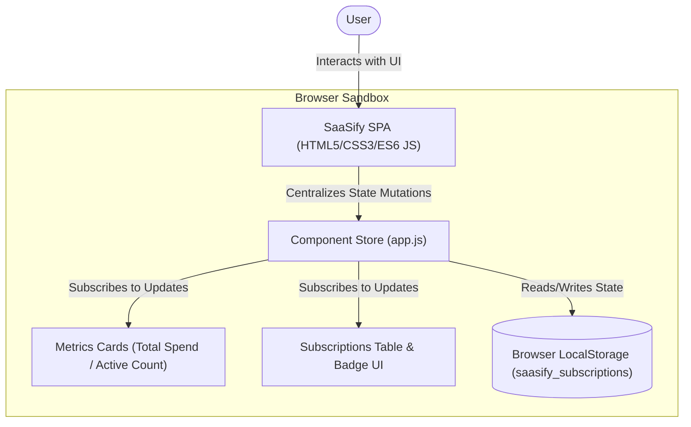

# Permit to Build Application: SaaSify Subscription Tracker

**Applicant:** Ken (Lead Developer)  
**Project Title:** SaaSify Subscription Tracker  
**Target Architecture Altitude:** System Level  
**Date of Submission:** 2026-07-03  
**Status:** Submitted for LRB Review  

---

## 1. Executive Summary
This document is submitted to the Local Review Board (LRB) to obtain a **Permit to Build** for the *SaaSify Subscription Tracker*. 

SaaSify is a lightweight, single-page dashboard application designed to track software subscriptions, monitor monthly expenditures, and simulate role-based view permissions. The application operates entirely client-side, using browser-native technologies and local storage. This design completely eliminates server-side processing, network dependencies, and remote data collection, making the project zero-risk regarding security breaches and hosting overhead.

---

## 2. System Architecture & Design Paradigm

SaaSify employs a **Single Page Application (SPA)** architecture paired with a centralized **Component-Store Pattern** for state management. This ensures that all components (metrics cards, data tables, and input forms) read from and write to a single source of truth, guaranteeing data consistency.

### System Container Diagram
The following C4-style diagram outlines the boundary limits and data flow of the proposed system:

---

## 3. Compliance with Architectural Invariants (ADs)

The following core Architectural Decisions (ADs) govern the project and ensure compliance with LRB standards:

*   **AD-1: Pure Client-Side Execution (SPA):** All logic runs inside the user's browser sandbox. The server only hosts static, uncompiled files (`index.html`, `index.css`, `app.js`). This eliminates external database configurations, network vulnerabilities, and backend hosting costs.
*   **AD-2: Centralized Store & Validation:** All data changes are validated and applied through a single JavaScript Store class. Subscriptions must be structured with non-blank names, non-negative costs, valid billing cycles (`MONTHLY`, `ANNUAL`), and correct date formats. This prevents corrupt data shapes.
*   **AD-3: Local Storage Persistence & Sync:** Subscriptions and user roles are saved to browser `localStorage`. Multi-tab conflicts are avoided by checking state hashes before reloading data upon external storage events.
*   **AD-4: Role Simulation:** Allows testing the application under two separate roles (`ADMIN` and `VIEWER`). High-privilege actions (Add, Edit, Delete) are hidden from Viewers and blocked programmatically.

---

## 4. Security & Privacy Impact Assessment (SPIA)

Because SaaSify is built for local tracking, the security profile is highly favorable for rapid approval:

1.  **Data Sovereignty:** All subscription names, costs, and renewal dates remain in the user's local browser profile (`localStorage`). No data is transmitted over the network to external servers.
2.  **Mock Authentication:** The user profile selector in the header is a UI mock. There are no passwords, OAuth tokens, or session IDs stored, eliminating credential leakage risk.
3.  **Third-Party Code Minimization:** The application uses zero external NPM libraries, JS frameworks (no React/Vue/Angular), or CSS frameworks. All code is vanilla HTML5, CSS3, and ES6+ JS, precluding supply-chain attacks.

---

## 5. Verification and Test Plan

To verify that the implementation adheres to the approved specifications, the following compliance tests will be performed:

*   **TC-1 (Spend Calculation Accuracy):** Inputting annual subscriptions (e.g., $120/year) must yield a monthly spend increase of exactly $10.00. Paused subscriptions must add $0.00.
*   **TC-2 (RBAC Visibility):** Switching the role toggle to `VIEWER` must immediately hide the "Add Subscription" button and row-level "Edit/Delete" actions.
*   **TC-3 (Renewal Alert Logic):** Setting a subscription next renewal date to `current date + 3 days` must display the "Renewal Imminent" badge. Setting it to `current date - 1 day` or `current date + 8 days` must hide the badge.
*   **TC-4 (Offline Capability):** Reloading the application with network disabled must show full functionality, loaded from local assets and `localStorage`.

---

## 6. Request for Permit
The architecture described is optimized for simplicity, performance, and user privacy. We request the Local Review Board to grant a **Permit to Build** for the MVP.
